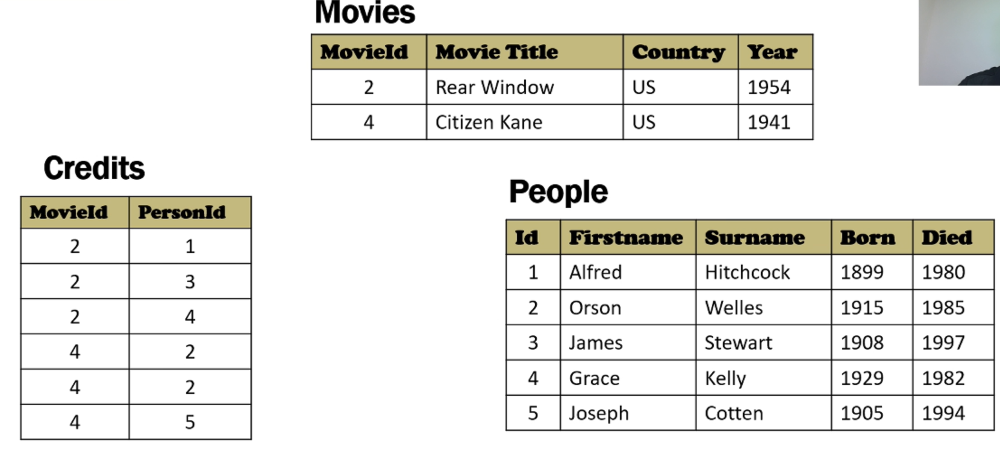

# Lecture 1
## Relational Database
* Rows(records or tuples): represent a "known fact".
* Columns(attributes): store a piece of data.
* The picture stored in the database is binary digital image.
### Operations
* select
* project
* join

### key
* Duplicates are forbidden in relational tables.
* The value of the key must be different.
* We choose the simplest key as PRIMARY KEY.
### Normalization
a process of standardize data.

* If countries >= 2, "main country" or table associating movieid with one or several countries.
  * If choose simplicity, may lose information.
* 1NF: (simple attributes) each solumn should only contain ONE piece of information.(So surname and first name should be stored in different columns.)
* 2NF: attributes if not a part of key, depend on the FULL key.
* 3NF:
