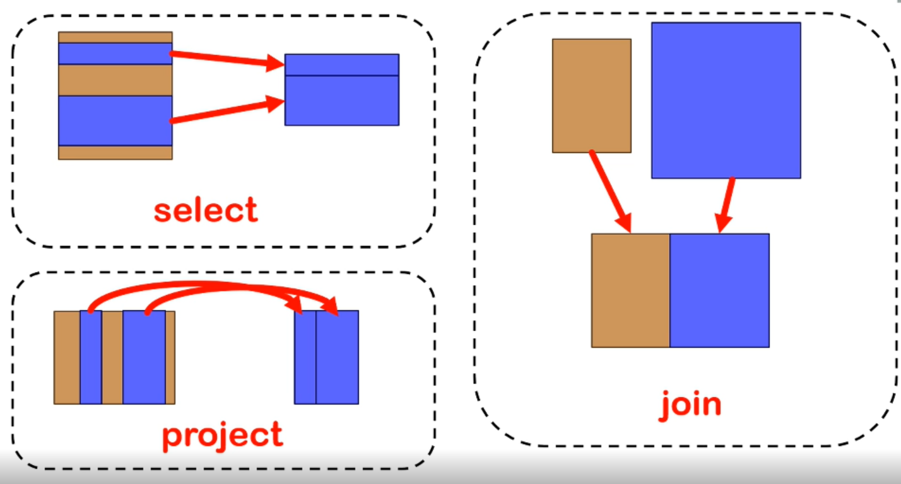
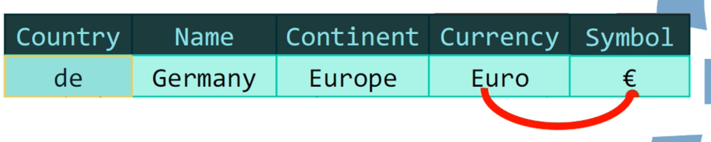

# Lecture 1
## Relational Database
* Rows(records or tuples): represent a "known fact".
* Columns(attributes): store a piece of data.
* The picture stored in the database is binary digital image.
### Operations
* select
* project
* join

### key
* Duplicates are forbidden in relational tables.
* The value of the key must be different.
* We choose the simplest key as PRIMARY KEY.
### Normalization
a process of standardize data.

* If countries >= 2, "main country" or table associating movieid with one or several countries.
  * If choose simplicity, may lose information.
* 1NF: (simple attributes) each solumn should only contain ONE piece of information.(So surname and first name should be stored in different columns.)
* 2NF: attributes if not a part of key, depend on the FULL key.

  * Continent only depends on country, which is only a part of key(not full).
* 3NF: non-key attributes not depend on each other.

  * Currency and symbol depend on each other. We can remove symbol or currency.
* Every non key attribute must provides a fact about the key, the whole key(2NF), and nothing but the key(3NF).
